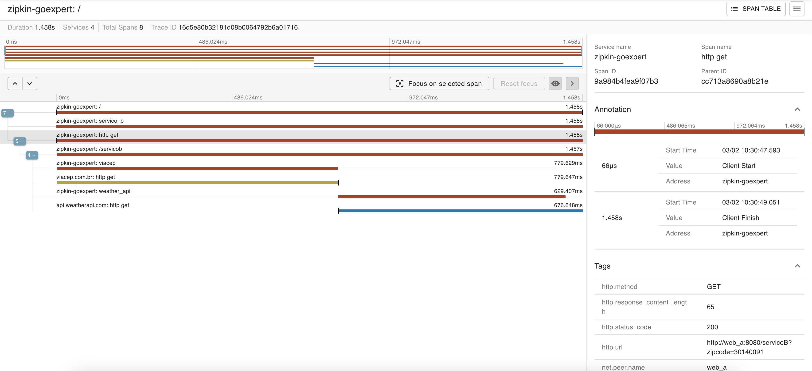

# Busca CEP  - Zipkin

O Serviço A roda no endpoint "/"
O Serviço B roda no endpoint "/servicoB"

Zipkin middleware injetado no servidor no arquivo "cmd/webserver/webserver"
Zipkin client usado em todas as requisiçoes "internal/infra/http_clients/ZipkinOtelClient"

Os logs ficam disponiveis em http://127.0.0.1:9411




Variáveis de ambiente:

| Variável        | Descrição                                                         |
|-----------------|-------------------------------------------------------------------|
| WEBSERVER_PORT  | A porta em que o servidor web estará disponível.                  |
| WEATHER_API_KEY | Chave de API para acessar a API de clima.                         |
| WEATHER_API_URL | URL da API de clima para obter dados de temperatura.              |
| CEP_API_URL     | URL da API de CEP para obter dados de localidade a partir do CEP. |


O projeto usa Viper para gerenciar as váriaveis de ambiente, que podem ser configuradas no OS, Google Cloud Console ou em um arquivo .env

O projeto possui testes integrados ao github actions e também pode ser testado com ``go test -v ./...``

Arquivo principal do projeto: https://github.com/aluferraz/go-expert-zipkin/blob/9af4e910f335af93eb9e50952489c6fd6a74995a/internal/usecase/get_temperature/get_temperature.go#L1

URL CloudRun: [https://go-expert-zipkin-tg3vmarlxq-uc.a.run.app](https://go-expert-zipkin-tg3vmarlxq-uc.a.run.app/?zipcode=30140091)https://go-expert-zipkin-tg3vmarlxq-uc.a.run.app/?zipcode=30140091 (Coloque o CEP desejado como parametro de url)

# Como utilizar
Clonar o repositório

Preencha sua API_KEY no docker-compose:
https://github.com/aluferraz/go-expert-zipkin/blob/48e1a7ade24732f5b557370e27d5546d06406ab1/docker-compose.yml#L8C1-L9C39

Em desenvolvimento, voce também pode criar um arquivo .env na raíz do projeto:
```
WEATHER_API_KEY=mysupersecret
```

Para executar a versão em dev:
``docker compose up``

Para executar a versão em prd (lembre-se de configurar a variavel de ambiente no docker-compose):
``
docker compose -f docker-compose.prod.yml build --no-cache
docker compose -f docker-compose.prod.yml up ``
